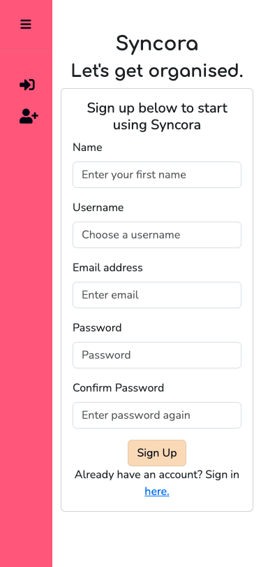
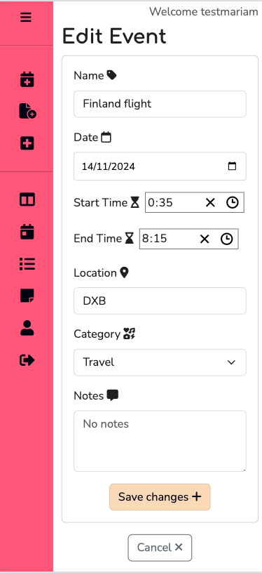
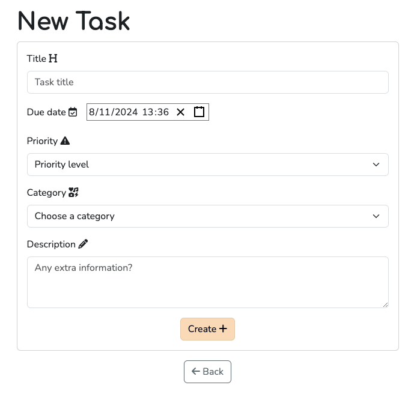

# Syncora

## Introduction

Syncora is a web application designed to help improve your productivity and organisation in day to day life. It allows you to view all your events, tasks and any notes you write down all in one place, making everything easier to find. Why not sign up today and start being the organised person you've always wanted to be?

This repository is for the front-end of the application, made using the React framework. The back-end of the project utilises the Django REST Framework. The repository for the back end can be found [here](https://github.com/mariam138/syncora_drf).

## Project Goals

**Syncora** is a web application that is the virtual version of a personal planner or diary. The primary goals of the app are:

1. Help users to stay organised by writing down tasks which need completing and any upcoming events. All of this information can then be found in one place in a much more condensed version compared to a paper diary.

2. Provide a place to write down any notes quickly and easily, compared to having to search around for a pen and paper to jot something down.

3. Provide a simple and easy to use interface, making it intuitive for anyone over the age of 13 to use.

4. Offer minimal but impactful features in an achievable development time, with the ability to further improve the app with more useful features in the future.

## User Stories

Planning of the features for **Syncora** was done with user stories. While brainstorming user stories, epics were created which were then further identified into themes.

### Themes

Three main themes were identified in the planning of this web app:

1. **User Account** - Anything to do with a user registering for the app, signing in and out and account deletion.

2. **User Interface** - This involves the design and layout of the web app, helping to provide an intuitive user experience while also providing an impactful design.

3. **App Features** - This involves the main features of the app that will define **Syncora** as a productivity app.

### Epics

The above themes were then split down further into the following epics:

- **User Account**

  - [#4](https://github.com/mariam138/syncora_react/issues/4) Account Registration
  - [#5](https://github.com/mariam138/syncora_react/issues/5) User Sign In/Out
  - [#6](https://github.com/mariam138/syncora_react/issues/6) Account Deletion
  - [#9](https://github.com/mariam138/syncora_react/issues/9) User Profile

- **User Interface**

  - [#7](https://github.com/mariam138/syncora_react/issues/7) Dashboard
  - [#8](https://github.com/mariam138/syncora_react/issues/8) Navigation

- **App Features**
  - [#10](https://github.com/mariam138/syncora_react/issues/10) Tasks
  - [#11](https://github.com/mariam138/syncora_react/issues/11) Events
  - [#12](https://github.com/mariam138/syncora_react/issues/12) Notes

Each epic above is directly linked to the issue created on Github as part of the Agile methodology used to create the app.

### User Stories

Each user story was then created based of the above epics. Each user story is linked to an epic and labelled using the **MoSCoW** approach: must have, should have, could have and won't have. All user stories can be viewed on the [Syncora Project Board](https://github.com/users/mariam138/projects/7).

## Agile Development Methodology

User stories were created using Github's **issues** feature. Then using Github's **projects** feature, a board was created to keep track of all user stories, epics and themes. The board was split into five main columns: one column for themes, one for epics, then three to keep track of each user story. These three were the default **To Do**, **In Progress** and **Completed** columns provided by Github when creating a project. Each user story was then labelled using the **MoSCoW** approach. Any feature that falls under CRUD functionality was labelled as a _must have_ feature. Story point labels were then created using a linear scale of: **1, 2, 4, 6 and 8**. I decided **not** to use a label for **16** story points because that would be considered an epic, so this felt like a redundant label.

For each iteration, a new **milestone** was created. Each milestone was then given a due by date to help keep on track throughout the creation of this project. An initial milestone was created to act like the **Product Back Log**, where all user stories were first moved to.

## Planning

### Wireframes

Wireframes were created to help with the design and layout of Syncora, using the 'must-have' user stories to ensure important features were included. Wireframes for both desktop and mobile were created. Below are the wireframes for the mobile layout.

These can be viewed in PDF format [here](https://github.com/mariam138/syncora_react/blob/main/readme_assets/syncora-mobile-wireframes.pdf).

From the start I already had a layout in mind for the dashboard for desktop, which the rest of the wireframes have been based around.

All remaining desktop wireframes can be found [here](https://github.com/mariam138/syncora_react/tree/main/readme_assets/desktop-wireframes). The to-do list picture used as part of the hero image on the register/sign in pages is from geralt on [pixabay](https://pixabay.com/illustrations/lists-to-do-paper-checkbox-tasks-6131220/).

### Database Models

Models for the database were planned out before starting creation of the project. These models can be found in detail on the back-end repository [here](https://github.com/mariam138/syncora_drf).

## Design

### Colour Scheme

I envinsioned a bright pink as the main colour for Syncora, using this base to then pick the rest of my colour palette. First, I searched different palettes based on pink to choose the shade of pink I wanted. Using [this](https://colorhunt.co/palette/ffbe98f05a7e125b9a0b8494) colour palette on _colorhunt.co_, I initially chose the colour `#F05A7E`. Entering this colour onto _coolors.co_ allowed me to then choose a slightly different, more muted shade of pink - `#FB6083`. I then checked the contrast of this colour against a black to ensure it met AAA accessibility guidelines. Using [this](https://www.learnui.design/tools/accessible-color-generator.html) colour generator on _Learn UI Design_, I chose the shade `#000010`, which will be used as text on the pink shade. Locking these two colours in on my _coolors.co_ colour palette, I then generated another colour to use as a secondary colour. The colour I chose was this wheat colour `#F5DFBB`. Finally, I picked a shade of white/cream as a fourth colour, again checking it's contrast on _Learn UI Design_ against the above black shade. The cream/white shade I settled on to meet AAA guidelines was `#FFF5F5`. Below is the final colour palette for Syncora.

Below is the contrast grid created on [Contrast Grid by Eightshapes](https://contrast-grid.eightshapes.com/?version=1.1.0&background-colors=&foreground-colors=%23FB6083%0D%0A%23000010%0D%0A%23F5DFBB%0D%0A%23FFF5F5%0D%0A&es-color-form__tile-size=compact&es-color-form__show-contrast=aaa) to check for passing contrast with the colour palette.

### Typography

Google fonts was used to provide fonts for this project. For the Syncora logo and for section headings, I decided to choose the font **Comfortaa**. It is a simple but rounded font which gives simplicity and modernity at the same time, perfect for the branding of Syncora. **Comfortaa** was found on [fontpair.co](https://www.fontpair.co/fonts/comfortaa). For all other text, I chose the font **Nunito**. Using [fontjoy.com](fontjoy.com), I generated fonts that would match **Comfortaa** but with a bit more contrast. **Nunito** was suggested, so I settled on this for all other text on the app.

## Features

### Reusable React Components

#### Sidebar

Rather than a traditional top navigation bar, I wanted to create a side bar menu instead for Syncora. To create this, I installed the **Contrast Design Bootstrap React (CDBReact)** package from _devwares.com_, following the [documentation](https://www.devwares.com/docs/contrast/react/navigation/sidebar/) to create and customise my sidebar menu. Although in the wireframes I had designed for the sidebar component to not be visible at all when collapsed, the CDBReact sidebar did not allow for this. I found this however to make the design more interesting and colourful. To compromise and ensure that it didn't take a lot of space when collapsed on mobile screens, I changed the minimum size from 80px to 75px. The sidebar component was then imported into the **root** route so that it would appear on all pages.

When a user visits and is logged out, only the 'Sign In' and 'Register' links are visible in the sidebar menu.

Once a user is logged in, the links change to access different features of the app including events, tasks, notes and the user's profile. The 'Dashboard' link acts as the homepage for the user, where they are able to see a brief overview of everything on one page. The user can also click to sign out from the side bar menu.

#### Top Navigation Bar

Alongside the sidebar menu, I created a simple and non-obstructive top navigation bar, building of the _React Bootstrap_ Navbar component. In this top nav bar, all that was included were three quick links for a user to create a new event, task or note, rather than clicking on to their respective pages first and then click to create a new entry. Also included in the top navigation bar is a simple welcome message for the user, used as a simple indication that they are logged in. Finally, on certain pages, I included a search bar to allow for the user to text search through their events, notes and tasks. This top navigation bar only appears on screens larger than 992px so as to not take up screen space on smaller screens. These three quick links are available in the sidebar menu instead when a user is on a smaller device.

#### Loading Spinner

Using the **Spinner** component from _React Boostrap_, I created a reusable loading spinner component. This component is used to visually indicate to users when something is loading, so was imported into other pages as needed.

#### Error Page

#### Delete Modal

During development, I realised I would be using a modal throughout the website to ask the user to confirm if they wanted to delete their account, task, event or note. So I decided to create a reusable modal component which could then be used on different pages. I created props which when passed down, could be used to change the modal title, the content, the `handleDelete` function, and it's show and closed states. This helped to save time manually re-writing a new modal on each page where needed.

##### Reusable Toast Notifications

I downloaded **react-toastify** to quickly create a toast notification to use rather than the standard bootstrap alerts, which take more space on the screen. The **react-toastify** library also allows the notifications to appear on screens which are navigated to after an action has occurred. For example, when a user signs up and are then redirected to the sign in page, a toast notification will appear telling them that registration was successful. This library made it easier to alert user's of events throughout the app seamlessly.

### Sign Up Form

The sign up form allows users to access the full functionality of the website. The user is asked to enter a username, an e-mail, and a password which is confirmed again. If any fields are blank, or if a username has already been taken, this is alerted to the user. E-mail is an optional field as set by the back-end library **dj-rest-auth**, so an alert does not show up here. Underneath the form is the option to sign in if a user already has an account. This redirects the user to the sign in form instead.

### Sign In Form

The sign in form is laid out similarly to the registration form, but instead only asks for a username and password to be entered. There is also a link below for users who don't have an account yet to allow them to register.

#### Hero Image

For both the sign up and sign in forms, a hero image appears to the right when viewed on a medium sized screen or larger.

### Sign Out Page

When a user clicks the sign out link in the sidebar, they will be redirected to a page asking them to confirm if they would like to sign out. They also have the option to go back to the previous page if they change their mind. Upon signing out, the user then gets redirected back to the sign in page.

### Profile Page

A user is able to view their own profile. Their profile picture, name, username and e-mail will be displayed. On initial registration, a defaul avatar will be provided. This can be changed on the profile page by uploading a new one. Images over 2MB won't be allowed. The user is also able to delete their own account. A modal will pop up asking the user to confirm their action.

For future features where users can be linked on tasks and events together, I have included functionality which prevents users from changing other profile's pictures or deleting their accounts. When viewing another user's profile page, the upload and delete account buttons will not be visible.

### Events

#### Events List

When the user clicks the 'Events' icon in the sidebar, they are redirected to the Events page where they are shown all their events in a list. The event title is displayed in a preview, and more basic information is displayed when opening the drop down. Each event also gives the option to view the event in more detail or delete the event. Users are also able to filter their events by category, or do a simple text search for an event. Past events are muted to allow more visual differentiation between each event. If an event is happening on the same day as the user has the app open, this will also be indicated. Underneath the list is the option to create a new event.

#### Event Detail

When viewing the event detail, the user can see the date, start time, end time, location, category and any notes that they have added. Underneath is the option to either edit the event or delete the event. Editing the event will bring up the event form, allowing them to easily update any information.

#### Create/Edit Events

When either creating or editing an event, a form will be displayed to the user. They will be able to enter or update the name, date, start time, end time, location, category and notes.

##### New Event Form

##### Edit form

### Tasks

#### Tasks List

When the user clicks the tasks icon in the sidebar, they are redirected to the tasks list page. A list of tasks are displayed which are split into two panes: To Do and Completed. Each task shows the title, priority level and the due date. The option to complete the task is also present, saving the need for the user to enter the edit form to complete them. Once completed, the task will move into the 'Completed' tab. If checked by accident, then the user is able to uncheck the task which will automatically move it back to the 'To Do' tab. Each task also allows the user to view the task in detail. Tasks can also be categorised using the filter button by priority or category, and will display all tasks whether they have been completed or not. Tasks can also be searched for by a simple text search. Underneath the list is the option to create a new task.

##### To do list

##### Completed list

#### Task Detail

When 'View task' is clicked, the user is able to view the task in detail. This includes the due date, priority, category, any description included and whether the task has been completed or not. From here, the user is able to either edit or delete the task.

#### Create/Edit Task

When either creating or editing a task, a form will be displayed to the user. They will be able to enter or update the title, due date, priority, category and description. Only when editing will the user also be able to click the 'Completed?' checkbox. This checkbox is not visible in the creation form.

##### Create Task Form

##### Edit Task Form

### Notes

#### Notes List

When navigating to the notes page, all of the user's notes are displayed with the most recently updated at the top. The title of the note is displayed (if there is one) and a brief overview of the content can be seen. Each note has a 'See more' button to view the note in detail. Undearneath the list is a link to create a new note.

#### Note Detail

When clicking the 'See more' button on the notes list, the user is then able to see the note in detail. The user can see the title is available, the full content and the date it was updated. Underneath the note are some 'Edit' and 'Delete' buttons for the note and then the option to return to the previous screen.

#### Create/Edit Note

When creating a new note, a simple form is displayed to the user with Title and Content inputs. The title is an optional feature for the note. The user can also navigate back to the previous page. If editing, the note detail is inserted into the form. The user is able to save the changes or cancel the edit.

##### Note Create Form

##### Note Edit Form

### Future Features and Improvements

## Bugs

1. When testing for form errors during creation of the sign up form, I came across an error stating the one of the field names was not defined. In my sign up form, I had included a name field so that when a user registered, it would become a part of their profile automatically, set up by the signals I created in the backend. I tried changing the name and value of the field to `fname`, `first_name` and just `name`, however none of these worked. Looking at the [dj-rest-auth](https://dj-rest-auth.readthedocs.io/en/stable/api_endpoints.html#registration) documentation, only four fields were accepted in the POST data: username, password1, password2 and email. So to overcome this bug, I removed the name field from the registration form, no longer producing the error.

2. Following on from the previous error, I then encountered another bug when testing the form errors for the registration form. Below is a screenshot of the console error I recieved:

   

   I double checked that all my settings were correct in both my front-end (_under api/axiosDefaults.js_) and the back-end (_under syncora_api/settings.py_). I had also ensured I followed both the instructions from Code Institute's React walkthrough project and the **axios** documentation to ensure I had set up my API correctly. After contacting some tutors for help, it appeared that it was due to package discrepencies in the backend. Changing the version of Django used to an older but still supported version fixed the error, allowing requests to be made to the API. More information about this error can be found in the back end [README](https://github.com/mariam138/syncora_drf#bugs).

3. When testing registration of users to Syncora, I noticed that the page wasn't refreshing or being redirected to the index like I had coded. Looking at the console showed a 500 error after registration. However, when I clicked the sign up button again with the same information, a form error would display stating that a user with that username already exists. I double checked that registration was successful by logging into the back end and finding their profile in the API. So it was unclear why a 500 error was being shown. After searching, I found a similar issue on GitHub under the **dj-rest-auth** repository. It seemed that the issue was with the e-mail set up in the back end. After adding the new email settings, I tested the registration feature again and was successfully being redirected to the index page as planned. More information about this bug can be found in the back end [documentation](https://github.com/mariam138/syncora_drf#bugs).

4. I was able to get signing in to the application up and running quickly and smoothly, however I then came across a bug when trying to implement custom context hooks. I wanted to be able to tell when a user was logged in so that I could conditionally render links in the sidebar based on that property. Following along with Code Institute's Moments [walkthrough](https://github.com/Code-Institute-Solutions/moments/blob/304244f540308ff4dd3c961352f55a633a4b3bed/src/contexts/CurrentUserContext.js) to create a _Current User_ hook, I tried to import this hook into my sign up form. However, when testing the sign in functionality again, I came across this error:

   > TypeError: setCurrentUser is not a function

   Even after checking all my imports, my `setCurrentUser` function was not being recognised. Logging it to the console gave the result `undefined`. Initially, when creating the `CustomUserProvider`, I had it wrapped around the routes in App.jsx. When moving the provider to main.jsx and having it wrap around the `<RouterProvider>` element, console logging the function no longer showed undefined. Testing the log in function again, it worked successfully and the links in the sidebar menu rendered as expected.

5. While testing out the registration and sign in feature on the deployed site to fix any bugs, a discrepancy occurred between a user's primary key and the corresponding profile primary key. A user was able to sign in properly, but clicking on the profile link would display a profile with an id that had yet to be created. Checking the network requests in the front end showed that the profile pk did not match the user pk. For example, a user which had the pk of 24 had a profile pk of 47. This discrepancy was confirmed by print statements in the back end of this project. I was not fully able to understand where the issue had come from, but potentially as there was an issue with Safari not logging users in after signing up, perhaps more user accounts were being created without a profile. However I do not think this was very likely. To overcome this bug, I created a new database and took the existing database information, removed the users from where the discrepancy began and reloaded that data into the new database. This fixed the issue and there were no longer discrepancies between the user and profile pk's.

6. An issue arose where the sidebar component would not toggle open and closed on smaller screensizes. Initially I thought it was a potential conflict with the screen size prop I had in my sidebar component which would conditionally render some sidebar links. However after adjusting the code this didn't work. Some console logs during development showed that the click handler was working, but not when actually clicking on the menu icon.

   

   I created some utility functions to refresh the access token timestamp, thinking that there was a conflict between the currentUser not being gotten properly which was affecting the toggle functionality. This also did not fix the issue. After some tutor help, it turned out that the Welcome user message I was displaying on smaller screensizes had a higher z-index than the sidebar, as a Navbar component was used to create this message. Creating a custom css class to lower the z-index of this navbar to below the z-index of the sidebar solved the bug.

## Frameworks, libraries and dependencies

- **vite 5.4.10** - Vite's React template was used to start and set up the Syncora front-end project. This was chosen over **create-react-app** as it is more up-to-date and maintained. The template was installed using the command `npm create vite@latest -- --template react`.
- **react-bootstrap** - Bootstrap is the framework used to style the front-end of Syncora. react-bootstrap is used to ensure compatability with React.
- **react-router-dom** - This is used to create routes/URLs for the front end of the application.
- **CDBReact** - This framework was installed to be able to use it's responsive sidebar component, made mobile-first and compatible with React and Boostrap.
- **Axios** - The Axios framework is used to easily send and get requests from the REST API backend created for Syncora
- **Mock Service Worker** - This was used to help mock an API when performing automated tests throughout the creation of Syncora. Setting up of MSW for testing was done following the [documentation](https://mswjs.io/docs/getting-started). MSW was only downloaded as a development dependency.
- **react-time-picker 7.0.0** - This library was downloaded to be able to allow users to choose a time for their events using a time picker widget.
- **react-toastify 10.0.4** - The _react-toastify_ library allows simple toast notifications to appear on the screen. This is used as indicators to the user if something was successful or to provide information.
- **react-datetime-picker 6.0.1** - This library was downloaded to be able to allow users to choose a date and time for their tasks.

## Testing

### Manual Testing

### Automated Testing

### Validators

#### W3C CSS Validator

#### ESLint JavaScript Validator

### Accessibility Testing

Due to CORS errors when using wave.webaim.org, causing the site not to load, I was unable to use it for accessibility testing. As an alternative, I used the accessibility testing provided by Google Chrome's Lighthouse testing, going through each page. An average accessibility score of 85 was given. The issues listed that were not fixable were mainly from the Sidebar component, built using CDBReact. These were the following warnings given:

These all stemmed from the sidebar. I added aria labels to the navlinks for each icon in the sidebar to further improve accessibility for accessible names. However, when the sidebar is expanded, more labelling is available for screenreaders, so I have chosen to dismiss this frist warning. 

The lists error is again due to the sidebar, where it is rendered as a nav which contains an unordered list. Inside each unordered list is a link which then contains the list item. As this is due to the combined use of React Router's NavLink component with the CDBReact Sidebar Menu Item, I was unable to fix this warning also.

### Lighthouse Testing

## Deployment

As this React app was built using Vite, some extra steps had to be taken in order to allow for a successful deployment. Extra steps were followed from [this](https://blog.md.engineer/vite-heroku-clkmnkq8h000709l7hxqe689p) blog post by Ndagi Stanley.

1. Open your Heroku dashboard and click **New**. From the dropdown menu, select _'Create new app'_
2. Choose a uniqe app name and an appropriate region. Click **Create app**
3. Install the **serve** package using the command `npm install serve`
4. In `package.json` include the following start script:
   > `"start": "serve -s dist"`
5. Ensure all changes are pushed to your repository before deployment
6. Back to the newly created app on Heroku, click the 'Deploy' tab. In the 'Deployment method' section, click on **GitHub**
7. Search for the repository and link it in the 'App connected to GitHub' section
8. In the 'Manual deploy' section, click **Deploy Branch**

## Accreditation

### Code

- Code to create the error page component is adapted from the [React Router](https://reactrouter.com/en/main/start/tutorial#handling-not-found-errors) docs
- Code to create the sidebar navigation is adapted from [this](https://www.devwares.com/blog/create-responsive-sidebar-in-react/) post on devwares.com
- Code to conditionally render the quick links in the menu only on smaller screens is adapted from a comment by _foakesm_ on [this](https://stackoverflow.com/questions/46586165/react-conditionally-render-based-on-viewport-size) post on stackoverflow
- Code which creates an instance of axios to allow use of a base URL with components was adapted from the [axios documentation](https://axios-http.com/docs/config_defaults)
- Code to create a custom context provider for the current user is adapted from [Code Institute's](https://github.com/Code-Institute-Solutions/moments/blob/master/src/contexts/CurrentUserContext.js) Moments walkthrough project
- Code to allow the profile upload button to open the user's device files is adapted from [this](https://medium.com/codex/use-a-button-to-upload-files-on-your-react-app-with-bootstrap-ef963cbe8280) post on medium by _Prince Shrestha_
- Code to create API interceptors for requests is adapted from Code Institute's Moments walkthrough [code](https://github.com/mr-fibonacci/moments/blob/a981c39da1671a70023a3d6f3cf1410164e84e06/src/contexts/CurrentUserContext.js)
- Code to add time to the current user's local time is adapted from [this post](https://javascript.plainenglish.io/javascript-add-hours-to-date-6e3a39bb9345) by Tari Ibaba
- Code to complete tasks using the form checkbox is adapted from [React School](https://react.school/todo-list/completing-tasks)
- Code to allow the tasks list component to be scrollable on the dashboard is adapted from [this post](https://community.plotly.com/t/set-max-height-to-a-div-and-make-the-content-vertically-scrollable/28873) on community.plotly.com
- Code to allow filtering by user input is adapted from [this post](https://www.dhiwise.com/post/reactjs-filter-array-of-objects-effortless-data-handling) by Kesar Bhimani on www.dhiwise.com
- Code to create a real time search filter for events, tasks and notes is adapted from [this post](https://dev.to/alais29dev/building-a-real-time-search-filter-in-react-a-step-by-step-guide-3lmm#step-2-creating-the-input) by Alfonsina Lizardo on dev.to

### Media

- Post it note picture used as the hero image for sign in and sign up pages is from [pixabay.com](https://pixabay.com/illustrations/lists-to-do-paper-checkbox-tasks-6131213/)
- Favicon is by Dewi Sari on [flaticon.com](https://www.flaticon.com/free-icon/loop_10151980?term=sync&page=1&position=71&origin=tag&related_id=10151980)

### Other

- The instructions to prepare the repository for deployment were adapted from [this](https://blog.md.engineer/vite-heroku-clkmnkq8h000709l7hxqe689p) post by Ndagi Stanley
- The GitHub issue for the 500 console error when registering is found [here](https://github.com/iMerica/dj-rest-auth/issues/61) on the **dj-rest-auth** GitHub repository
